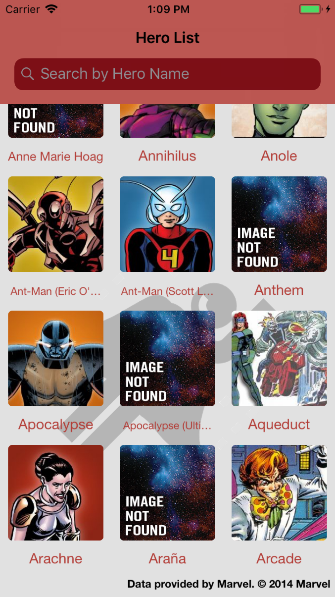

# Hero Guide
### How to Execute
* Open the aplication folder and execute `pod install`, in your terminal.
* Open the `Hero Guide.xcworkspace` file with you XCode and run the project.
### Libraries Used
* CCBottomRefreshControl - https://github.com/vlasov/CCBottomRefreshControl
* Kingfisher - https://github.com/onevcat/Kingfisher
* SwiftHash - https://github.com/onmyway133/SwiftHash
* Alamofire - https://github.com/Alamofire/Alamofire
* ObjectMapper - https://github.com/Hearst-DD/ObjectMapper
### Screenshots

 

